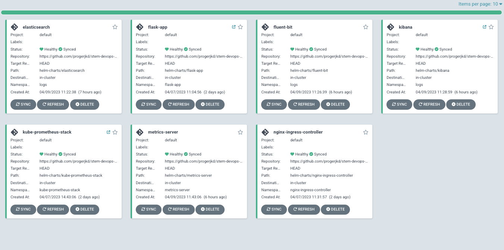
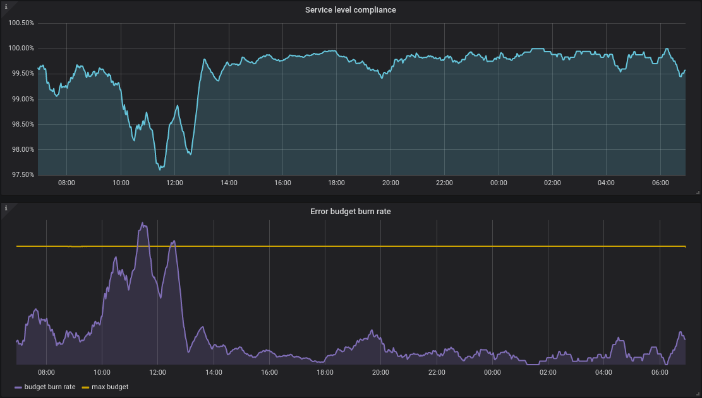

This repository contains the source code of a sample application, and associated helm charts.

# Helm charts:

## elasticsearch, fluent-bit and kibana

We use the EFK (Elasticsearch, fluent, kibana) stack for centralized monitoring.
Fluent-bit is deployed as a DaemonSet on every node, collects container logs and ships to elasticsearch. We can visualize the logs on the Kibana interface.

## metrics-server

Metrics Server is a scalable, efficient source of container resource metrics for Kubernetes built-in autoscaling and monitoring.

## kube-prometheus-stack

Stack to deploy prometheus and grafana for alarming, and monitoring.

## nginx-ingress-controller

Helm chart to deploy nginx ingress controller. An NLB is deployed on AWS which uses the nginx pods as a target group. Nginx can do the routing to the internal services and expose applications.

## flask-app

The helm char used to deploy the sample application. The application is exposed via an ingress to the host 'flask.example.org'. Autoscaling is configured with the following configuration:

    autoscaling:
      enabled: true
      minReplicas: 2
      maxReplicas: 5
      targetCPUUtilizationPercentage: 80

# GitHub Actions pipeline

A github action pipeline is defined in the file `.github/workflows/pipeline.yaml`.
The pipeline fetchs the app code, builds the docker image and uploads it to docker hub.

# Accessing the services:

The services can be accessed via the ELB using by the nginx-ingress-controller.
The URLs are configured as follows, and a static mapping should be made in your /etc/hosts file for the ip address of the ELB:

    $ host a9e935a90cf254f87a5b89df9cd0a0b0-956449603.us-east-1.elb.amazonaws.com
    a9e935a90cf254f87a5b89df9cd0a0b0-956449603.us-east-1.elb.amazonaws.com has address 54.209.66.171

    echo '54.209.66.171 kibana.example.org' >> /etc/hosts
    echo '54.209.66.171 flask.example.org' >> /etc/hosts
    echo '54.209.66.171 grafana.example.org' >> /etc/hosts

Finally, we should be able to access the folowing URLs on the browser (only HTTPS traffic is being listening on the ingress controller)

https://grafana.example.org

https://kibana.example.org/

https://flask.example.org/hello/user1

The argocd service can be accessible via the ELB URL: https://a44e2b17677bc4d9993f3e6ae36148fd-308439214.us-east-1.elb.amazonaws.com/

The credentials to access the services were sent via email.

# TO DO:

- I'd say that for fully acomplish the goals, it would be needed to fully integrate the CI and CD stages. After uploading the docker image to docker hub, generate an image version and tag, and then update the helm chart definition file to use the newly created image version.

# Extended objectives

We could measure the Service Level Indicators (SLI) by inspecting the grafana dashboards. Grafana organizes and puts prometheus metrics together in dashboards.
SLIs can measure single entities like hosts, pods, or services, or across multiple entities using metric labels. 
When SLIs are breached, they can be actioned by integrating with downstream systems like PagerDuty, slack or automation end points to alert SRE teams. 

